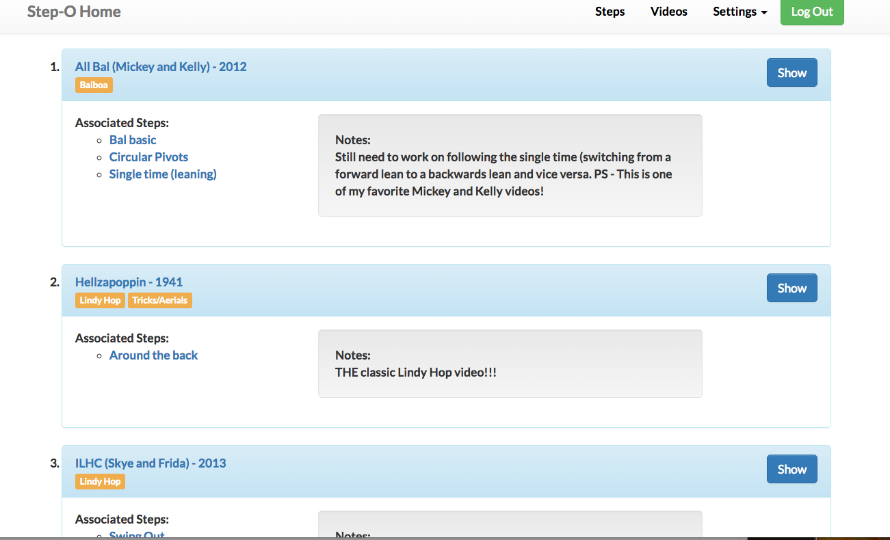

Month six of my development training, and I am wrapping up project 4 of 5.  This time around, we were required to build dynamic features onto our existing Rails app (project 3), using jQuery and an Active Model Serialization JSON API.  

Although it took a while to wrap my head around the lessons in this unit, working with Ajax and jQuery in my project was quite fun.  I often find my brain is able to solidify and fully understand concepts only after playing with them on my own terms, rather than in lesson exercises, and that happened to be the case in this situation again.  

I'm sure there are best practices in navigating the DOM and I am still learning, but one technique I found very useful was the storage of information in HTML [data attributes.](http://www.w3schools.com/tags/att_global_data.asp)  In my own case, I used the data attributes both as "breadcrumbs" to mark and find specific elements later, and as hidden storage for much larger chunks of code.

###1. Using data attributes as "breadcrumbs":

The examples below will all focus on the videos index page of my app, for which I wanted to build nested, drop down information a user could toggle in and out of view.   (My app is a dance step organizer, which assists users in organizing dance steps they would like to learn, and the YouTube videos those steps can be found in.)





My goal was to be able to click the "Show" button, and replace the existing data (video notes, etc) with the full video showpage, including the embeded version of the video itself.  The button should then change to say "Close," and upon clicking it a second time, the original html should return.  Note - I did not simply want to append and toggle, but replace a whole section of html inside a particular list item with a different section of html.  


Challenges I considered:

1. Once I have made my ajax request and returned the desired video show page data, how do I target which list element to change? 
2. Where can I save that list element's original html, so that I can fetch it and inject it back in, when the "Close" button is clicked?


To tackle the first problem, I simply stored the id of the video object that is located in the particuler list element I would like to affect with my jquery.  Below is the actual div (inside of my list element) that I would like to replace with the show page html.  You can see the addition of the data-id.  I also added the data-id information onto the "Show" button itself.

` <div class="panel-body" data-id="<%= video.id%>">`

` <button id="trigger" data-id="<%= video.id%>">Show</button>`

Then, in my javascript, I did the following:

```javascript
 videoId = $(event.target).data().id; // This retrieves and stores the video id from the button element
 
 $('li div.panel').each(function(index, body){
            if ($(this).find('.panel-body').data().id === videoId){// This finds the panel body that is in the same <li> as the button that was clicked.
              var indexHTML = $(this).find('.panel-body').html(); // Stores the existing html in a variable
              $(this).find('.panel-body').html(replacementHTML); // And replaces that html with my show page html
```
 
By inserting a data-id attribute into both the button element and the div containing the panel body, I was able to associate one with the other, and drop my new html into the correct list item.  (To note - iterating through a large number of elements to find the one with the correct id may not be the most effecient solution for large bodies of data.  However, in the case of my index page, I am using pagination to limit the number of list items that appear.)

###2. Using data attributes to store larger chunks of code:

Once my "Show" button properly triggered the video drop down in the correct list item, there was still the challenge of how to get the original html back upon clicking "Close."  I could store the orginal html in a variable to retrieve later, but what if I have multiple list items "open?"  Do I declare multiple variables?  That would certainly become confusing and cluttered very quickly.  

Instead, why not use a data attribute again, to store the old html inside of its own parent list element?  This proved to be very handy!


```javascript
$('li div.panel').each(function(index, body){
            if ($(this).find('.panel-body').data().id === videoId){
              var indexHTML = $(this).find('.panel-body').html(); // Assigns the existing html to a variable
              $(this).find('.panel-body').html(replacementHTML);// Replaces that html with my show page html
              $(this).data( 'old_html', indexHTML ); // Stores the previous html as a data attribute within its parent <li>
 ```

More explanation of this technique (and other helpful ideas) can be found in this [Stackoverflow post.] (http://stackoverflow.com/questions/13040763/javascript-jquery-get-and-hold-elements-initial-html-content)  

By storing the entire block of html as a data attribute, I was then able to retrieve and restore it at a later point in time (when the user clicks "Close.")

```javascript
function videoCloseListener(){
  $('li').on('click', '.revert', function(event){ //upon clicking the "Close" button
     videoId = $(event.target).data(); // hold onto the data-id attribute stored in the button
    $('li div.panel').each(function(index, body){
      if ($(this).find('.panel-body').data().id === videoId.id){// find the panel body with the corresponding data-id
        $(this).find('.panel-body').html($(this).data().old_html); // restore the original html
        $(this).find('.revert').attr("class","trigger").text("Show"); // change the button from "Close" back to "Show"
       };;
    });
  });
}
```


I'm sure there are other (potentially even better) ways to achieve the same goals as illustrated above.  However, in my first attempt at incorporating jQuery, Ajax, and a JSON API into a personal project, I found the incorporation of HTML data attributes to be very useful!  Perhaps this blog post may help others who, like myself, are just starting out.  

Thanks for stopping by!


