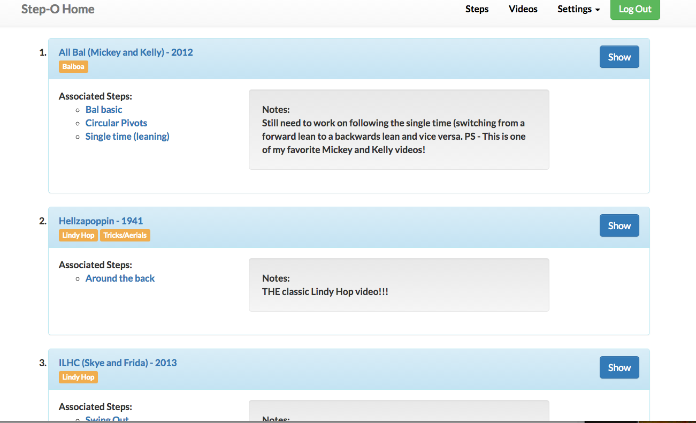

Month six of my development training, and I am wrapping up project 4 of 5.  This time around, we were required to build dynamic features onto our existing Rails app (project 3), using jQuery and an Active Model Serialization JSON API.  

Although it took a while to wrap my head around the lessons in this unit, working with Ajax and jQuery in my project was quite fun.  I often find my brain is able to solidify and fully understand concepts only after playing with them on my own terms, rather than in lesson exercises, and that happened to be the case in this situation again.  

I'm sure there are best practices in navigating the DOM and I am still learning, but one technique I found very useful was the storage of information in HTML data attributes.  In my own case, I used the data attributes both as breadcrumbs to mark and find specific elements later, and as hidden storage for much larger chunks of code.

###1. Using data attributes as breadcrumbs:

Two different pages of my app contain list items, for which I wanted to build nested, drop down information a user could toggle in and out of view.  The first page in discussion is a videos index page.  (My app is a dance step organizer, which assists one in organizing dance steps they would like to learn, and the YouTube videos they can be found in.)




My goal was to be able to click on the "Show" button, and replace the existing data (video notes, etc) with the full video showpage, including the embeded version of the video itself.  The button should then change to say "Hide," and upon clicking it a second time, the original html should return.  Note - I did not simply want to append and toggle, but replace a whole section of html inside a particular list item with a different section of html.  

Challenges:

1. Once I have made my ajax request and returned the desired video show page data, how do I target which list element to change? 
2. Where can I save that list element's original html, so that I can fetch it and inject it back in, when the "Hide" button is clicked?

Both of these I addressed by using HTML [data attributes.](http://www.w3schools.com/tags/att_global_data.asp)  

To tackle the first problem, I simply stored the id of the video object that is located in the particuler list element I would like to affect with my jquery.  Below is the actual div (inside of my list element) that I would like to replace with the show page html.  You can see the addition of the data-id.  I also added the data-id information onto the "Show" button itself.

` <div class="panel-body" data-id="<%= video.id%>">`

` <button id="trigger" data-id="<%= video.id%>">Show</button>`

Then, in my javascript, I did the following:

```javascript
 videoId = $(event.target).data().id; // This retrieves and stores the video id from the button element
 
 $('li div.panel').each(function(index, body){
            if ($(this).find('.panel-body').data().id === videoId){// This finds the panel body that is in the same <li> as the button that was clicked.
              var indexHTML = $(this).find('.panel-body').html();
              $(this).find('.panel-body').html(replacementHTML); // And replace that html with my show page html
```
 
 More text...


